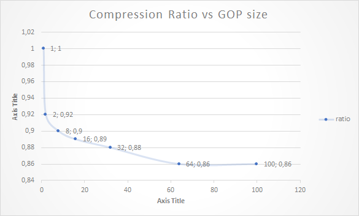
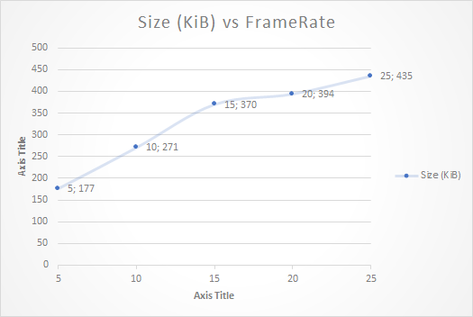
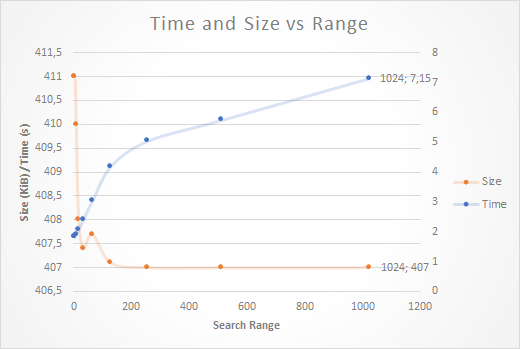

# Practica AVCONV

**German Dempere Guillermo**

> En aquesta pràctica utilitzareu l’eina avconv per tal d’estudiar de forma sistemàtica l’impacte en el rendiment d’un còdec de vídeo dels diferents paràmetres de configuració.  
> `avconv` és un programa lliure i multiplataforma que permet recodificar informació d’àudio i vídeo, amb un munt d’opcions configurables per línia de comandes.

## Exercici 1

La notació `DEVILS` queda explicada al principi del output de la comanda `avconv -codecs` de la següent forma:

```
D..... = Decoding supported
.E.... = Encoding supported
..V... = Video codec
..A... = Audio codec
..S... = Subtitle codec
...I.. = Intra frame-only codec
....L. = Lossy compression
.....S = Lossless compression
```

De manera que cada lletra de la paraula `DEVILS` significa que el codec en particular soporta una serie de caracteristiques.

## Exercici 2

Suport pels codecs mencionats:
```
DEVIL. mjpeg                Motion JPEG
DEV.L. mpeg1video           MPEG-1 video (decoders: mpeg1video mpeg1video_vdpau )
DEV.L. mpeg4                MPEG-4 part 2 (decoders: mpeg4 ...) (encoders: mpeg4 ... )
DEV.LS h264                 H.264 / AVC / MPEG-4 AVC / MPEG-4 part 10 ...
```

`mjpeg` és l'unic que fa servir codificació exclusivament _inter-frame_, mentres que els altres fan servir les dos, ho podem saber per la existencia o no de la `I` en el resum `DEVILS` de les caracteristiques, que implica `Intra frame-only codec`.

Si nosaltres a practiques farem servir similitud de tesseles entre _frames_, els codecs que més s'assemblen al que estem fent son els que fan ús d'aquesta caracteristica, com per exemple `mpeg2video`

## Exercici 3

Comparativa de Codecs, ordenada per qualitat del video final:

|#   | Codec     | Temps     | Memoria       |Mida fitxer       |
|--- |---        |---        |---            |---               |
|1   | h264      | 1.676 s   | 79.69 MiB     | 404 KiB          |
|2   | mpeg1video| 0.216 s   | 45.84 MiB     | 224 KiB          |
|3   | mpeg4     | 0.220 s   | 46.01 MiB     | 192 KiB          |
|2   | mjpeg     | 0.248 s   | 44.86 MiB     | 672 KiB          |

`H.264` resulta, amb moltissima diferencia, d'una millor qualitat que la resta, que realment no es distancien tant entre ells.

## Exercici 4

Taula de Ratios de Compressió

|#   | Codec     | Ratio    |
|--- |---        |---       |
|2   | mjpeg     | 1        |
|1   | h264      | 0.60     |
|3   | mpeg1video| 0.33     | 
|4   | mpeg4     | 0.29     |

Prenen `mpeg` com a referencia per al ratio de compressió perque es l'unic codec que no te compressió _inter-frame_ i per tant es equivalent a guardar totes les imatges amb compressió `jpeg` directament i no fer res més sobre elles. Per tant, tota la resta de compressió que puguin fer els altres codecs sera a traves de trobar similituds entre _frames_.

## Exercici 5



Com podem veure a la grafica, variant el GOP el que aconseguim es que `H.265` pugi fer servir o no la compressió _inter-frame_, amb un gop de 1 no pot comprimir en absolut entre _frames_, tal i com queda reflectat al `output log`, on ens indica que tots els _frames_ son _I-Frames_:

```
[libx264 @ 0x84dd920] frame I:100   Avg QP:28.82  size:  451
```

En comparació a un GOP de 100, on només tenim 9 d'aquest tipus de _frames_, la resta son _P-Frames_, construit a partir dels tipus `I`:

```
[libx264 @ 0x9735920] frame I:9     Avg QP:25.74  size:  6500
[libx264 @ 0x9735920] frame P:91    Avg QP:28.59  size:  3977
```

## Exercici 6



El resultat de decrementar el `framerate` de sortida mentres mantemin el d'entrada igual es que el video durará el mateix, pero com a la sortida estarem generant menys _frames_ per segon, la mida del fitxer será obviament menor.

Es pot observar una relació practicament lineal entre `framerate` i mida del fitxer.

## Exercici 7

|Method  | Time   | Size       |
|---     |---     |---         |
| SAD    | 1.25 s | 416.2 KiB  |
| SSE    | 1.27 s | 416.2 KiB  |
| SATD   | 1.25 s | 416.2 KiB  | 
| CHROMA | 1.70 s | 412.9 KiB  |


- **SAD**: Suma absoluta dels errors. Mesura estandard de similitud.
- **SSE**: Quadrat dels errors, un altra manera d'agafar el valor absolut, pero com es quadratic, petites diferencies fan petits errors, i grans diferencies fan errors no lineal, sino exponencialment més grans. I.e. `2 - 6 -> SAD:4 | SSE:16`
- **SATD**: Transformació Fourier discreta en dos dimensions. Un metode que intenta estimar i compensar el moviment a nivell de sub-pixels.
- **CHROMA**: Fent servir les imperfeccions humanes en percepció de color (més sensibilitat a uns colors que altres), es calculen diferencies ponderades per aquestes sensivilitats per poder trobar més similituds.

Com podem veure a la taula, el metode de comparació que més tarda, amb differencia, es el que compara fent servir la informació de color, `chroma`. Amb aquest metode aconseguim retallar 4KiB de la mida final del fitxer, pero a un cost de processament molt elevat.

Si ens interesa comprimir al maxim el fitxer final, pot sortir a compte fer servir la opció de `chroma`. Pero si el nostre temps de CPU es més car que el cost de transmetre la informació, qualsevol dels altres mètodes resultara més efectiu.

## Exercici 8

- **DIA**: Estimació de moviment per busqueda de coincidencies en un patró amb forma de diamant.
- **HEX**: Busqueda de coincidencies en un patró amb forma hexagonal.
- **UMH**: Busqueda de coincidencies en una serie de patrons de hexagons solapats, intentant encaixar el millor vector the moviment per a angles poc comuns.
- **FULL**: Busqueda exhaustiva per tot l'espai definit al `me_range`, pixel a pixel.

|Method  | Time   | Size       |
|---     |---     |---         |
| DIA    | 1.66 s | 413.5 KiB  |
| HEX    | 1.70 s | 412.9 KiB  |
| UMH    | 2.03 s | 408.3 KiB  | 
| FULL   | 2.76 s | 406.5 KiB  |

Veiem que com més espai de posibilitats volem cobrir, més augmenta el temps de processat. En el cas extrem, el metode `FULL` triga quasi el doble que el metode més sencill `DIA`. Observant els temps i el tamany resultant, es podria dir que el métode més rentable es `UMH`.

## Exercici 9



Podem observar a la grafica, que no per buscar molt lluny trobarem coincidencies que facin millorar el tamany del fitxer. De fet, a partir de un _search range_ de més de 64, el temps de processament es dispara, sense millorar en absolut.

Un valor optim en aquest video seria entre 16 i 32. Més d'aixó ens fa perdre molt de temps per no guanyar res.


## Exercici 10

Seguint l'ordre dels exercicis, escollim els seguents paràmetres:

- **Codec**: h.264. Millor qualitat amb diferencia.
- **GOP**: 50. Alineat en 2 blocs, ja que tenim 100 imatges. Resulta en 16 `I-Frames`.
- **Framerate**: No hi ha motiu per baixar de 25 FPS
- **Compare**: SATD es tecnologicament avançat, i no causa una baixada del rendiment.
- **ME Method**: UMH Dona bons resultats i alhora comprimeix una mica més que les alternatives.
- **ME Range**: 32, no cal fer busquedes lluny de la tessel·la d'origen.

Amb aquests parametres obtenim un video satisfactori. Realment costa veure la diferencia tant en tamany de fitxer com en qualitat entre els molts parametres que tenim disponibles. Les diferencies reals les hem vist al principi entre els diferents codecs.