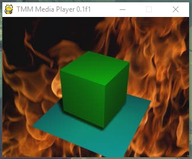
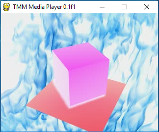
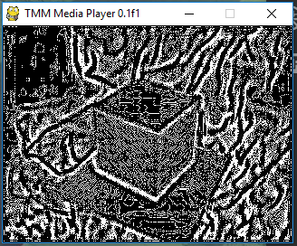

# PyGame Powered Media Player

Using the excellent PyGame Python library for graphics and image manipulation, we can easily play back a sequence of images at a target framerate of our choosing.

## Installation

### Regular Installation

**Requires:**
- Python 2.7
- numpy
- scipy
- pygame

### Using VirtualEnv

```
cd .
virtualenv env
source env/bin/activate
pip install -r requirements.txt
```

## Usage

Command line interface help:

```
usage: main.py [-h] [-i <filepath>] [-o <filepath>] [--fps <integer>]
               [--binarization <threshold>] [--negative] [--edge]
               [--averaging <radius>]

Media Player

optional arguments:
  -h, --help            show this help message and exit
  -i <filepath>         path to input ZIP file
  -o <filepath>         path to output folder to store resulting frames
  --fps <integer>       Playback framerate
  --binarization <threshold>
                        Binarization threshold (anything lower will become
                        black
  --negative            Set flag to invert image
  --edge                Set flag run laplacian Edge detection
  --averaging <radius>  Average blur filter radius
```

**Example**

To play back `assets/Cubo.zip` with negative video effect and then store all frames inside an
`out` folder:

```
python main.py --negative -o out
```

## Demo

**Regular Playback**  


**Negative Effect Playback**  


**Averaging + Edge Detection**  
